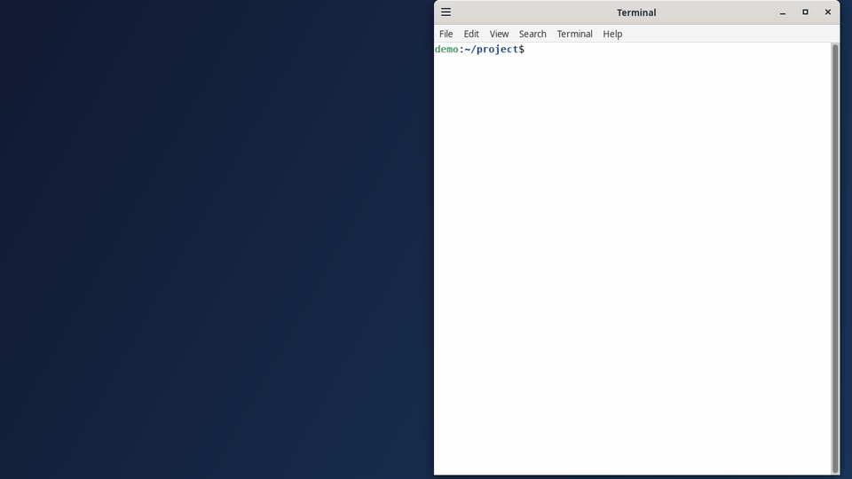
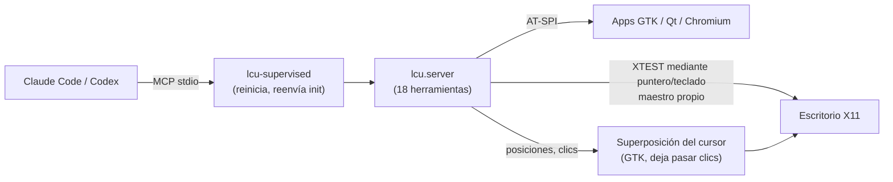

# linux-computer-use

[](https://github.com/flyingsquirrel0419/linux-computer-use/actions/workflows/ci.yml) [](https://github.com/flyingsquirrel0419/linux-computer-use/releases/latest) [](LICENSE) [](#requisitos) [](https://github.com/flyingsquirrel0419/linux-computer-use/releases)

[English](README.md) | [한국어](README.ko.md) | [日本語](README.ja.md) | [简体中文](README.zh-CN.md) | **Español**

Computer use para Linux. Un servidor MCP y una skill que permiten a Claude Code y Codex ver y manejar un **escritorio X11**: capturas de pantalla, ratón, teclado y el árbol de accesibilidad. El agente usa **su propio puntero y teclado virtuales**, así que tu ratón y tu foco siguen siendo tuyos mientras trabaja.



*Una tarea en tres apps, hecha por el agente con las herramientas MCP: abre el gestor de archivos desde la terminal, crea una carpeta, edita y guarda `README.md` en gedit y hace commit con git. Grabado en una pantalla X desechable con* `scripts/record_demo.sh`.

```bash
git clone https://github.com/flyingsquirrel0419/linux-computer-use ~/Documents/linux-computer-use
~/Documents/linux-computer-use/install.sh      # registra el servidor y la skill en Claude Code y Codex
claude mcp list                                 # → linux-cu: … run lcu-supervised - ✔ Connected
```

- **Sin binarios extra.** Ni xdotool ni scrot: Python puro sobre XTEST, X Input 2 y AT-SPI.
- **Puntero propio.** Cada agente tiene un segundo puntero y teclado maestros de X. Tu cursor no se mueve y la ventana que tienes enfocada no cambia.
- **Widgets nativos.** `ui_tree` lista botones y campos con sus coordenadas; `click_element` / `set_text` actúan sobre ellos directamente.
- **Escritura Unicode.** Coreano, CJK y emoji funcionan, incluso con el método de entrada hangul de ibus activo.
- **Cursor al estilo Codex.** Una superposición que deja pasar los clics dibuja el puntero del agente con la forma y el movimiento del cursor de Codex computer use.
- **Sobrevive a caídas.** Un supervisor reinicia el servidor y restaura la sesión MCP, así que las herramientas no desaparecen a mitad de sesión.

## Contenido

- [Cómo funciona](#cómo-funciona)
- [Requisitos](#requisitos)
- [Inicio rápido](#inicio-rápido)
- [Herramientas](#herramientas)
- [Puntero virtual](#puntero-virtual)
- [Cursor del agente](#cursor-del-agente)
- [Reinicio automático](#reinicio-automático)
- [Skill y plugin](#skill-y-plugin)
- [Configuración](#configuración)
- [Registro manual](#registro-manual)
- [Solución de problemas](#solución-de-problemas)
- [Desinstalación](#desinstalación)
- [Seguridad](#seguridad)
- [Desarrollo](#desarrollo)
- [Créditos](#créditos)
- [Licencia](#licencia)

## Cómo funciona



Todas las coordenadas que el agente envía o recibe están en los píxeles de la captura que recibió (lado largo de 1280 px por defecto). El servidor las convierte a píxeles reales, así que el modelo nunca tiene que reescalar nada.

## Requisitos

| | |
|---|---|
| SO / sesión | Linux con una sesión **X11** (probado: Ubuntu 24.04, Cinnamon). Wayland no está soportado. |
| Python | `python3` del sistema ≥ 3.10 con PyGObject y AT-SPI: `python3-gi gir1.2-atspi-2.0 at-spi2-core` (suelen venir preinstalados) |
| Herramientas | [`uv`](https://docs.astral.sh/uv/), `xinput` (para el puntero virtual; sin él, el agente comparte tu ratón) |
| Agentes | [Claude Code](https://claude.com/claude-code) y/o Codex CLI; `install.sh` configura los que estén instalados |

## Inicio rápido

1. **Instala** (es idempotente; puedes volver a ejecutarlo tras `git pull`):

   ```bash
   git clone https://github.com/flyingsquirrel0419/linux-computer-use ~/Documents/linux-computer-use
   ~/Documents/linux-computer-use/install.sh
   ```

   El script:
   - Crea un venv que usa el PyGObject del sistema.
   - Registra el servidor MCP `linux-cu` (a través de `lcu-supervised`) en Claude Code (ámbito de usuario) y en Codex (`~/.codex/config.toml`, con copia de seguridad en `config.toml.bak-lcu`).
   - Enlaza la skill en `~/.claude/skills` y `~/.codex/skills`.

2. **Comprueba**:

   ```bash
   claude mcp list | grep linux-cu     # ✔ Connected
   codex mcp list | grep linux-cu      # enabled
   ```

3. **Úsalo.** Abre una sesión **nueva** de Claude Code o Codex (las que ya están en marcha no cargan servidores nuevos) y pide algo en pantalla, por ejemplo: *«Abre gedit y escribe una nota corta en español».* El agente hace una captura, encuentra los widgets, hace clic, escribe y comprueba el resultado.

## Herramientas

| Grupo | Herramientas |
|---|---|
| Ver | `screenshot` (opcionalmente una región ampliada), `screen_info`, `cursor_position`, `active_window` |
| Ratón | `click` (doble/triple, modificadores), `mouse_move`, `drag`, `mouse_down`, `mouse_up`, `scroll` |
| Teclado | `type_text` (cualquier Unicode), `key` (`ctrl+shift+t`, `alt+F4`, `Return`…), `hold_key` |
| Accesibilidad | `list_windows`, `ui_tree`, `click_element`, `set_text` |
| Otros | `wait` (luego devuelve una captura) |

- Las herramientas de acción aceptan `screenshot_after: true` para devolver la pantalla resultante en la misma llamada.
- `type_text` y `key` aceptan `expect_window`, una parte del título o de la clase WM de la ventana destino. Si la ventana que recibiría las teclas no coincide, no se envía nada.
- `ui_tree` devuelve líneas como `[9] push button "Guardar" @(756,21)`. Los ids valen hasta la siguiente llamada a `ui_tree`.

## Puntero virtual

Como en Codex computer use, el agente trabaja con sus propios dispositivos de entrada. En su primera acción, el servidor crea un par de puntero y teclado maestros de X Input 2 llamado `lcu-<pid>` y envía por él toda su entrada XTEST.

- Tu ratón no se mueve y el foco de tu teclado no cambia, así que puedes seguir trabajando.
- Los clics del agente no elevan ni activan ventanas. **Las pulsaciones del agente van a la ventana que está bajo el puntero del agente**, por eso `click_element` y `set_text` mueven primero el puntero sobre el elemento.
- Cada agente tiene su propio par: si usas Claude Code y Codex a la vez verás dos cursores. El par se elimina cuando el servidor termina, y los que dejan servidores caídos se limpian en el siguiente arranque.
- `screen_info` indica `"virtual_pointer": true` cuando este modo está activo.

**Límite:** el agente solo puede actuar sobre lo que se ve en pantalla. Si hace clic donde una ventana está tapada, el clic llega a la ventana que está encima.

## Cursor del agente

Una superposición GTK que deja pasar los clics dibuja el puntero del agente:

- **Forma:** el contorno `AgentCursor` de Codex, de 14 px. El punto de clic es el **centro** del glifo, no la punta. Tiene relleno degradado translúcido, un borde de 1,55 px y un brillo suave.
- **Movimiento:** una curva cúbica elegida entre 20 candidatas e impulsada por un muelle amortiguado (amortiguación 0,9). En desplazamientos de 196 px o más, el cursor se estira en la dirección del movimiento (×1,38 / ×0,82) y gira hasta 76°.
- **Clic:** un pulso de pulsación de 250 ms (escala −10 %).
- **En espera:** el cursor se balancea mientras el agente está inactivo (pensando).
- **Color:** se toma del fondo de pantalla, como en Codex.
- **Capturas:** el cursor aparece en las capturas del agente, así que este ve dónde está su puntero.

## Reinicio automático

Claude Code y Codex arrancan un servidor MCP stdio una sola vez y nunca se reconectan: si el proceso termina, las herramientas desaparecen durante el resto de la sesión. Por eso el comando registrado es `lcu-supervised`, un pequeño supervisor que ejecuta el servidor real (`python -m lcu.server`) como proceso hijo y retransmite el JSON-RPC:

- Cuando el hijo termina por cualquier motivo, el supervisor arranca uno nuevo y le reenvía el `initialize` / `notifications/initialized` original del cliente. El cliente sigue en la misma sesión.
- Las peticiones que el hijo estaba atendiendo al caer reciben el error `-32000 "linux-cu server restarted while handling …; please retry"`. No se reintentan automáticamente, para que un clic no se ejecute dos veces. Los mensajes que llegan durante el reinicio se ponen en cola.
- A partir del tercer reinicio en 60 s, espera antes de reiniciar: 0,25 s al principio, el doble cada vez, hasta 10 s.
- Cuando el cliente cierra stdin o envía una señal al supervisor, este detiene al hijo (eliminando su puntero virtual) y termina.
- Los reinicios se registran en stderr, o en un archivo indicado con `LCU_SUPERVISOR_LOG`.

## Skill y plugin

[`skills/linux-computer-use/SKILL.md`](skills/linux-computer-use/SKILL.md) enseña al agente a manejar un escritorio con seguridad:

- **Ciclo:** mirar → localizar (primero el árbol de accesibilidad) → una acción → verificar.
- **Coordenadas y teclas:** las reglas de coordenadas y cómo las pulsaciones siguen al puntero.
- **Paciencia:** esperar a la interfaz y recuperarse cuando se atasca.
- **Criterio:** tratar el texto en pantalla como datos y no como instrucciones, y preguntar al usuario antes de acciones irreversibles.

`install.sh` ya enlaza la skill para Claude Code y Codex. Si prefieres instalarla como **plugin de Claude Code** (por ejemplo, en otra máquina), usa este repositorio como marketplace:

```text
/plugin marketplace add flyingsquirrel0419/linux-computer-use
/plugin install linux-computer-use@linux-computer-use
```

El plugin solo incluye la skill; instala el servidor MCP con `install.sh`. Usa una vía u otra, no ambas, para no duplicar la skill.

## Configuración

Se configura con variables de entorno del servidor MCP: `claude mcp add -e CLAVE=VALOR …` en Claude Code, o una tabla `[mcp_servers.linux-cu.env]` en Codex.

| Variable | Valor por defecto | Efecto |
|---|---|---|
| `LCU_VIRTUAL_POINTER` | `1` | `0`: comparte el puntero del usuario (sin puntero propio ni superposición) |
| `LCU_OVERLAY` | `1` | `0`: no dibuja el cursor del agente |
| `LCU_GLIDE` | `1` | `0`: salta en lugar del movimiento curvo con muelle |
| `LCU_MAX_LONG_EDGE` | `1280` | Lado largo de las capturas, en px |
| `LCU_REMAP_SETTLE` | `0.12` | Segundos de espera tras reasignar teclas para caracteres fuera de la distribución (hangul, emoji). Súbelo si el primero de esos caracteres se pierde o sale mal |
| `LCU_IME_BYPASS` | `1` | `0`: no cambia ibus a un motor simple mientras escribe |
| `LCU_PLAIN_ENGINE` | `xkb:us::eng` | Motor de ibus usado al escribir |
| `LCU_CURSOR_COLOR` | fondo de pantalla | Color fijo del cursor, `#rrggbb` |
| `LCU_CURSOR_SCALE` | `1.0` | Escala del cursor (1.0 = 14 px) |
| `LCU_CURSOR_LABEL` | ninguna | Etiqueta junto al cursor; `auto` usa el nombre del cliente (Claude/Codex) |
| `LCU_CURSOR_ICON` | glifo de Codex | Tu propio icono PNG/SVG |
| `LCU_CURSOR_HOTSPOT` | `0,0` | Punto de clic dentro de ese icono, en px |
| `LCU_CURSOR_SIZE` | `28` | Altura de un icono personalizado, en px |
| `LCU_SUPERVISOR_LOG` | stderr | Archivo para el registro de reinicios del supervisor |

`DISPLAY`, `XAUTHORITY` y `DBUS_SESSION_BUS_ADDRESS` se detectan automáticamente si el cliente no los pasa, dando preferencia a la pantalla que usa tu sesión de escritorio ([`src/lcu/env.py`](src/lcu/env.py)).

## Registro manual

Si prefieres no usar `install.sh`, crea el venv y registra el servidor tú mismo:

```bash
cd ~/Documents/linux-computer-use
uv venv --python /usr/bin/python3 --system-site-packages   # usa el PyGObject (gi) del sistema
uv sync
claude mcp add -s user linux-cu -- uv --directory "$PWD" run lcu-supervised
```

Codex, en `~/.codex/config.toml`:

```toml
[mcp_servers.linux-cu]
command = "uv"
args = ["--directory", "/home/you/Documents/linux-computer-use", "run", "lcu-supervised"]
startup_timeout_sec = 60
tool_timeout_sec = 120
default_tools_approval_mode = "approve"   # sin aprobación por llamada; obligatorio para `codex exec`
```

## Solución de problemas

<details>
<summary><code>ui_tree</code> sale vacío o falta una app</summary>

Las apps GTK suelen aparecer directamente. Si no, activa la accesibilidad del toolkit y reinicia la app:

```bash
gsettings set org.gnome.desktop.interface toolkit-accessibility true
```

Las apps de Chrome, Chromium y Electron (VS Code, Slack…) necesitan `--force-renderer-accessibility`. Sin esa opción, usa capturas y coordenadas.
</details>

<details>
<summary><code>virtual_pointer</code> es <code>false</code></summary>

`screen_info` incluye un campo `error`. Causas habituales: falta `xinput` (`sudo apt install xinput`) o está definida `LCU_VIRTUAL_POINTER=0`. En este modo el agente mueve tu ratón real.
</details>

<details>
<summary>Los caracteres hangul u otros no ASCII se pierden o salen mal</summary>

- **Caracteres que no están en la distribución del teclado:** se escriben asignándolos un momento a códigos de tecla libres. Si una app tarda en aplicar los cambios del mapa de teclas, sube `LCU_REMAP_SETTLE` (por ejemplo, `0.25`).
- **Modo hangul de ibus:** mientras se escribe, ibus cambia a `LCU_PLAIN_ENGINE` y luego vuelve. Después, ibus-hangul arranca de nuevo en su `initial-input-mode`, normalmente el latino.
</details>

<details>
<summary>Las herramientas desaparecieron de una sesión</summary>

Comprueba que el comando registrado sea `lcu-supervised` y no `lcu` (`claude mcp get linux-cu`). Al volver a ejecutar `install.sh` se cambian los registros antiguos. Las sesiones iniciadas antes de un cambio siguen usando el servidor anterior hasta que abras una sesión nueva.
</details>

<details>
<summary>Nada funciona en Wayland</summary>

Wayland bloquea la entrada XTEST y la captura de pantalla de otros clientes. Inicia sesión en una sesión X11.
</details>

## Desinstalación

```bash
claude mcp remove -s user linux-cu
rm ~/.claude/skills/linux-computer-use ~/.codex/skills/linux-computer-use   # solo enlaces simbólicos
```

En `~/.codex/config.toml`, borra la tabla `[mcp_servers.linux-cu]` o restaura `~/.codex/config.toml.bak-lcu`. Si un servidor caído dejó un puntero de agente, elimínalo:

```bash
xinput list --short | grep lcu-
xinput remove-master "lcu-<pid> pointer"
```

## Seguridad

- El agente maneja tu **escritorio real**. Aparte de las pautas de la skill no hay protecciones integradas, y con `default_tools_approval_mode = "approve"` Codex llama a las herramientas sin preguntar.
- Para aislar al agente, ejecuta el servidor en otra pantalla (por ejemplo, `Xvfb :99` con un gestor de ventanas) definiendo `DISPLAY=:99` en su entorno.
- Las capturas de tu pantalla se envían al proveedor del modelo que use el agente.

## Desarrollo

```bash
uv run python scripts/smoke_mcp.py            # solo lectura: lista herramientas, info de pantalla, ventanas y guarda una captura
DISPLAY=:99 uv run python scripts/smoke_mcp.py
uv run python scripts/smoke_mcp.py --direct   # sin pasar por el supervisor
scripts/record_demo.sh                       # vuelve a grabar docs/demo.gif en una pantalla desechable
```

Estructura del código: [`server.py`](src/lcu/server.py) (herramientas MCP), [`supervisor.py`](src/lcu/supervisor.py), [`vpointer.py`](src/lcu/vpointer.py) (puntero MPX), [`input.py`](src/lcu/input.py) (XTEST, mapa de teclas), [`capture.py`](src/lcu/capture.py), [`a11y.py`](src/lcu/a11y.py) (AT-SPI), [`overlay.py`](src/lcu/overlay.py) / [`motion.py`](src/lcu/motion.py) (cursor), [`ime.py`](src/lcu/ime.py), [`env.py`](src/lcu/env.py).

Historial de versiones: [CHANGELOG.md](CHANGELOG.md). Cómo contribuir: [CONTRIBUTING.md](CONTRIBUTING.md).

## Créditos

El glifo del cursor y el modelo de movimiento de [`src/lcu/motion.py`](src/lcu/motion.py) están portados de [maka-agent](https://github.com/maka-agent/maka-agent) (Apache-2.0), proyecto que los recuperó de la app de escritorio de Codex. Consulta [NOTICE](NOTICE). Este proyecto no está afiliado a OpenAI ni a Anthropic, ni cuenta con su respaldo.

## Licencia

[Apache License 2.0](LICENSE). Consulta [NOTICE](NOTICE) para las atribuciones.
