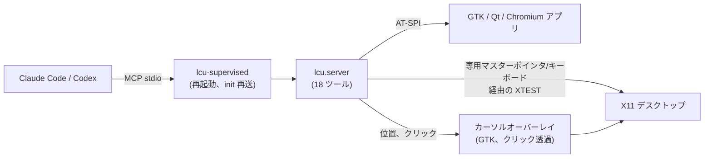

# linux-computer-use

[](https://github.com/flyingsquirrel0419/linux-computer-use/releases/latest)

[English](README.md) | [한국어](README.ko.md) | **日本語** | [简体中文](README.zh-CN.md) | [Español](README.es.md)

Linux 向けの computer use です。Claude Code と Codex が **X11 デスクトップ**を見て操作できるようにする MCP サーバー兼スキルで、スクリーンショット・マウス・キーボード・アクセシビリティツリーを扱います。エージェントは**専用の仮想ポインタとキーボード**を使うので、作業中もあなたのマウスとフォーカスはそのままです。

```bash
git clone https://github.com/flyingsquirrel0419/linux-computer-use ~/Documents/linux-computer-use
~/Documents/linux-computer-use/install.sh      # Claude Code と Codex にサーバーとスキルを登録
claude mcp list                                 # → linux-cu: … run lcu-supervised - ✔ Connected
```

- **追加バイナリ不要。** xdotool や scrot は使わず、純粋な Python で XTEST・X Input 2・AT-SPI を扱います。
- **専用ポインタ。** エージェントごとに 2 つ目の X マスターポインタとキーボードを作ります。あなたのカーソルは動かず、フォーカス中のウィンドウも変わりません。
- **ネイティブウィジェット。** `ui_tree` がボタンや入力欄を座標付きで一覧にし、`click_element` / `set_text` で直接操作します。
- **Unicode 入力。** 韓国語・CJK・絵文字を入力できます。ibus のハングル入力が有効でも大丈夫です。
- **Codex 風カーソル。** クリックを透過するオーバーレイが、Codex computer use と同じ形と動きでエージェントのポインタを描きます。
- **クラッシュから復帰。** スーパーバイザーがサーバーを再起動して MCP セッションを復元するので、セッション途中でツールが消えません。

## 目次

- [仕組み](#仕組み)
- [要件](#要件)
- [クイックスタート](#クイックスタート)
- [ツール](#ツール)
- [仮想ポインタ](#仮想ポインタ)
- [エージェントカーソル](#エージェントカーソル)
- [自動再起動](#自動再起動)
- [スキルとプラグイン](#スキルとプラグイン)
- [設定](#設定)
- [手動登録](#手動登録)
- [トラブルシューティング](#トラブルシューティング)
- [アンインストール](#アンインストール)
- [安全性](#安全性)
- [開発](#開発)
- [クレジット](#クレジット)
- [ライセンス](#ライセンス)

## 仕組み



エージェントがやり取りする座標はすべて、受け取ったスクリーンショットのピクセル座標です(既定では長辺 1280 px)。実ピクセルへの変換はサーバーが行うので、モデルが換算する必要はありません。

## 要件

| | |
|---|---|
| OS / セッション | **X11** セッションの Linux(動作確認: Ubuntu 24.04、Cinnamon)。Wayland は非対応です。 |
| Python | PyGObject と AT-SPI を備えたシステムの `python3` 3.10 以上: `python3-gi gir1.2-atspi-2.0 at-spi2-core`(通常はプリインストール済み) |
| ツール | [`uv`](https://docs.astral.sh/uv/)、`xinput`(仮想ポインタ用。無い場合はエージェントがあなたのマウスを共用します) |
| エージェント | [Claude Code](https://claude.com/claude-code) と Codex CLI のいずれか、または両方。`install.sh` はインストール済みの方を設定します |

## クイックスタート

1. **インストール**(何度実行しても安全です。`git pull` の後に再実行できます):

   ```bash
   git clone https://github.com/flyingsquirrel0419/linux-computer-use ~/Documents/linux-computer-use
   ~/Documents/linux-computer-use/install.sh
   ```

   このスクリプトが行うこと:
   - システムの PyGObject を使う venv を作ります。
   - `linux-cu` MCP サーバーを `lcu-supervised` 経由で Claude Code(ユーザースコープ)と Codex(`~/.codex/config.toml`、バックアップは `config.toml.bak-lcu`)に登録します。
   - スキルを `~/.claude/skills` と `~/.codex/skills` にシンボリックリンクします。

2. **確認**:

   ```bash
   claude mcp list | grep linux-cu     # ✔ Connected
   codex mcp list | grep linux-cu      # enabled
   ```

3. **使う。** Claude Code または Codex のセッションを**新しく**開きます(実行中のセッションは新しいサーバーを読み込みません)。そして画面上の作業を頼みます。例: *「gedit を開いて日本語で短いメモを書いて」*。エージェントはスクリーンショットを撮り、ウィジェットを探してクリック・入力し、結果を確認します。

## ツール

| 分類 | ツール |
|---|---|
| 見る | `screenshot`(領域の拡大も可)、`screen_info`、`cursor_position`、`active_window` |
| マウス | `click`(ダブル/トリプル、修飾キー)、`mouse_move`、`drag`、`mouse_down`、`mouse_up`、`scroll` |
| キーボード | `type_text`(任意の Unicode)、`key`(`ctrl+shift+t`、`alt+F4`、`Return` など)、`hold_key` |
| アクセシビリティ | `list_windows`、`ui_tree`、`click_element`、`set_text` |
| その他 | `wait`(待機後にスクリーンショットを返す) |

- 操作ツールに `screenshot_after: true` を渡すと、結果の画面を同じ呼び出しで受け取れます。
- `type_text` と `key` は `expect_window`(対象ウィンドウのタイトルまたは WM クラスの一部)を受け付けます。キーを受け取るウィンドウが一致しなければ何も送りません。
- `ui_tree` は `[9] push button "保存" @(756,21)` のような行を返します。id は次に `ui_tree` を呼ぶまで有効です。

## 仮想ポインタ

Codex computer use と同じく、エージェントは自分専用の入力デバイスで作業します。最初の操作のときに、サーバーが `lcu-<pid>` という X Input 2 のマスターポインタとキーボードのペアを作り、すべての XTEST 入力をそこへ送ります。

- あなたのマウスは動かず、キーボードフォーカスも変わらないので、作業を続けられます。
- エージェントのクリックはウィンドウを前面に出したりアクティブにしたりしません。**エージェントのキー入力はエージェントのポインタの下にあるウィンドウに届きます。**そのため `click_element` と `set_text` は先にポインタを要素の上へ動かします。
- エージェントごとにペアが作られます。Claude Code と Codex を同時に使うとカーソルが 2 つ見えます。サーバー終了時にペアは削除され、クラッシュで残ったペアは次回起動時に片付けられます。
- このモードが有効なとき、`screen_info` は `"virtual_pointer": true` を返します。

**制限:** エージェントは画面に見えているものしか操作できません。隠れたウィンドウの位置をクリックすると、手前にあるウィンドウがクリックされます。

## エージェントカーソル

クリックを透過する GTK オーバーレイがエージェントのポインタを描きます。

- **形:** Codex の `AgentCursor` の輪郭で、14 px です。クリック位置は矢印の先端ではなく**中心**です。半透明のグラデーション塗り、1.55 px の縁取り、柔らかなグローがあります。
- **動き:** 20 個の候補から選んだ 3 次曲線を、減衰係数 0.9 のスプリングでたどります。196 px 以上動くときは進行方向に伸び(×1.38 / ×0.82)、最大 76° 傾きます。
- **クリック:** 250 ms の押下パルス(サイズ −10 %)が出ます。
- **待機:** エージェントが待機中(思考中)のときは小さく揺れます。
- **色:** Codex と同じく壁紙から取ります。
- **スクリーンショット:** カーソルはエージェントのスクリーンショットにも写るので、エージェントは自分のポインタの位置を確認できます。

## 自動再起動

Claude Code と Codex は stdio MCP サーバーを一度起動するだけで、再接続しません。そのためプロセスが終了すると、そのセッションではツールが使えなくなります。そこで登録するコマンドは `lcu-supervised` です。本体のサーバー(`python -m lcu.server`)を子プロセスとして動かし、JSON-RPC を中継する小さなスーパーバイザーです。

- 子プロセスが理由を問わず終了すると、新しく起動し直し、クライアントが最初に送った `initialize` / `notifications/initialized` を再送します。クライアントは同じセッションを使い続けられます。
- 終了時に処理中だったリクエストには `-32000 "linux-cu server restarted while handling …; please retry"` エラーを返します。クリックが二重に実行されないよう、自動再試行はしません。再起動中に届いたメッセージはキューに入れて後で送ります。
- 60 秒以内の 3 回目の再起動からは、少し待ってから再起動します。待ち時間は 0.25 秒から毎回 2 倍になり、最大 10 秒です。
- クライアントが stdin を閉じるか、スーパーバイザーにシグナルが届くと、子プロセスを止め(仮想ポインタも削除)、一緒に終了します。
- 再起動の記録は stderr に出ます。`LCU_SUPERVISOR_LOG` でファイルに残すこともできます。

## スキルとプラグイン

[`skills/linux-computer-use/SKILL.md`](skills/linux-computer-use/SKILL.md) は、エージェントがデスクトップを安全に扱うための指針です。

- **作業の流れ:** 見る → 探す(アクセシビリティツリーを優先) → 一度に 1 つの操作 → 確認。
- **座標とキー入力:** 座標のルールと、キー入力がポインタに従うこと。
- **待つこと:** UI の表示を待つことと、行き詰まったときの対処。
- **判断:** 画面上の文章は指示ではなくデータとして扱い、取り消せない操作の前にはユーザーに確認します。

`install.sh` はすでに Claude Code と Codex にスキルをリンクしています。代わりに **Claude Code プラグイン**として入れたい場合(別のマシンなど)は、このリポジトリをマーケットプレイスとして追加します。

```text
/plugin marketplace add flyingsquirrel0419/linux-computer-use
/plugin install linux-computer-use@linux-computer-use
```

プラグインに含まれるのはスキルだけです。MCP サーバーは `install.sh` で入れてください。スキルが重複しないよう、どちらか一方の方法だけを使ってください。

## 設定

MCP サーバーの環境変数で設定します。Claude Code では `claude mcp add -e KEY=VALUE …`、Codex では `[mcp_servers.linux-cu.env]` テーブルを使います。

| 変数 | 既定値 | 効果 |
|---|---|---|
| `LCU_VIRTUAL_POINTER` | `1` | `0`: あなたのポインタを共用(専用ポインタもオーバーレイもなし) |
| `LCU_OVERLAY` | `1` | `0`: エージェントカーソルを描かない |
| `LCU_GLIDE` | `1` | `0`: 曲線とスプリングの動きの代わりに瞬間移動 |
| `LCU_MAX_LONG_EDGE` | `1280` | スクリーンショットの長辺(px) |
| `LCU_REMAP_SETTLE` | `0.12` | レイアウトにない文字(ハングル、絵文字)用にキーを再割り当てした後の待ち時間(秒)。そうした文字の 1 文字目が抜けたり別の文字になったりする場合は増やしてください |
| `LCU_IME_BYPASS` | `1` | `0`: 入力中に ibus を通常エンジンへ切り替えない |
| `LCU_PLAIN_ENGINE` | `xkb:us::eng` | 入力中に使う ibus エンジン |
| `LCU_CURSOR_COLOR` | 壁紙 | 固定のカーソル色 `#rrggbb` |
| `LCU_CURSOR_SCALE` | `1.0` | カーソルの倍率(1.0 = 14 px) |
| `LCU_CURSOR_LABEL` | なし | カーソル横の名札。`auto` でクライアント名(Claude/Codex) |
| `LCU_CURSOR_ICON` | Codex グリフ | 自作の PNG/SVG アイコン |
| `LCU_CURSOR_HOTSPOT` | `0,0` | そのアイコン内のクリック位置(px) |
| `LCU_CURSOR_SIZE` | `28` | カスタムアイコンの高さ(px) |
| `LCU_SUPERVISOR_LOG` | stderr | スーパーバイザーの再起動ログの出力先ファイル |

クライアントが `DISPLAY`、`XAUTHORITY`、`DBUS_SESSION_BUS_ADDRESS` を渡さない場合は自動で検出します。ディスプレイはデスクトップセッションが使っているものを優先します([`src/lcu/env.py`](src/lcu/env.py))。

## 手動登録

`install.sh` を使わない場合は、venv を作ってサーバーを自分で登録します。

```bash
cd ~/Documents/linux-computer-use
uv venv --python /usr/bin/python3 --system-site-packages   # システムの PyGObject(gi)を使う
uv sync
claude mcp add -s user linux-cu -- uv --directory "$PWD" run lcu-supervised
```

Codex は `~/.codex/config.toml` に追加します。

```toml
[mcp_servers.linux-cu]
command = "uv"
args = ["--directory", "/home/you/Documents/linux-computer-use", "run", "lcu-supervised"]
startup_timeout_sec = 60
tool_timeout_sec = 120
default_tools_approval_mode = "approve"   # 呼び出しごとの承認を省略。`codex exec` では必須
```

## トラブルシューティング

<details>
<summary><code>ui_tree</code> が空、またはアプリが表示されない</summary>

GTK アプリは通常すぐに表示されます。表示されない場合はツールキットのアクセシビリティを有効にし、アプリを再起動してください。

```bash
gsettings set org.gnome.desktop.interface toolkit-accessibility true
```

Chrome・Chromium・Electron アプリ(VS Code、Slack など)には `--force-renderer-accessibility` が必要です。無い場合はスクリーンショットと座標で操作します。
</details>

<details>
<summary><code>virtual_pointer</code> が <code>false</code> になる</summary>

`screen_info` の `error` 項目を見てください。よくある原因は、`xinput` が入っていない(`sudo apt install xinput`)か、`LCU_VIRTUAL_POINTER=0` が設定されていることです。このモードではエージェントがあなたの実際のマウスを動かします。
</details>

<details>
<summary>ハングルなどの非 ASCII 文字が抜ける、または違う文字になる</summary>

- **キーボードレイアウトにない文字**は、空きキーコードに一時的に割り当てて入力します。キーマップの変更を反映するのが遅いアプリでは `LCU_REMAP_SETTLE` を増やしてください(例: `0.25`)。
- **ibus のハングルモード:** 入力中は ibus を `LCU_PLAIN_ENGINE` に切り替え、終わったら戻します。その後 ibus-hangul は `initial-input-mode`(通常は英字)から始まります。
</details>

<details>
<summary>セッションからツールが消えた</summary>

登録コマンドが `lcu` ではなく `lcu-supervised` になっているか確認してください(`claude mcp get linux-cu`)。`install.sh` を再実行すると古い登録が切り替わります。変更前に始めたセッションは、新しいセッションを開くまで古いサーバーを使います。
</details>

<details>
<summary>Wayland では何も動かない</summary>

Wayland は他のクライアントからの XTEST 入力と画面キャプチャをブロックします。X11 セッションでログインしてください。
</details>

## アンインストール

```bash
claude mcp remove -s user linux-cu
rm ~/.claude/skills/linux-computer-use ~/.codex/skills/linux-computer-use   # シンボリックリンクのみ削除
```

`~/.codex/config.toml` から `[mcp_servers.linux-cu]` テーブルを削除するか、`~/.codex/config.toml.bak-lcu` から復元してください。クラッシュでエージェントのポインタが残った場合は削除します。

```bash
xinput list --short | grep lcu-
xinput remove-master "lcu-<pid> pointer"
```

## 安全性

- エージェントは**実際のデスクトップ**を操作します。スキルの指針以外に組み込みの安全装置はありません。`default_tools_approval_mode = "approve"` のとき、Codex は確認せずにツールを呼び出します。
- エージェントを隔離したい場合は、サーバーの環境に `DISPLAY=:99` を設定し、別のディスプレイ(ウィンドウマネージャーを動かした `Xvfb :99` など)で実行してください。
- あなたの画面のスクリーンショットは、エージェントが使うモデルの提供元に送信されます。

## 開発

```bash
uv run python scripts/smoke_mcp.py            # 読み取り専用: ツール一覧、画面情報、ウィンドウ一覧、スクリーンショット保存
DISPLAY=:99 uv run python scripts/smoke_mcp.py
uv run python scripts/smoke_mcp.py --direct   # スーパーバイザーを通さず直接接続
```

ソース構成: [`server.py`](src/lcu/server.py)(MCP ツール)、[`supervisor.py`](src/lcu/supervisor.py)、[`vpointer.py`](src/lcu/vpointer.py)(MPX ポインタ)、[`input.py`](src/lcu/input.py)(XTEST、キーマップ)、[`capture.py`](src/lcu/capture.py)、[`a11y.py`](src/lcu/a11y.py)(AT-SPI)、[`overlay.py`](src/lcu/overlay.py) / [`motion.py`](src/lcu/motion.py)(カーソル)、[`ime.py`](src/lcu/ime.py)、[`env.py`](src/lcu/env.py)。

## クレジット

[`src/lcu/motion.py`](src/lcu/motion.py) のカーソルグリフとモーションモデルは [maka-agent](https://github.com/maka-agent/maka-agent)(Apache-2.0)から移植したものです。同プロジェクトが Codex デスクトップアプリから復元した値です。[NOTICE](NOTICE) を参照してください。本プロジェクトは OpenAI および Anthropic とは無関係で、承認も受けていません。

## ライセンス

[Apache License 2.0](LICENSE)。帰属表示は [NOTICE](NOTICE) を参照してください。
