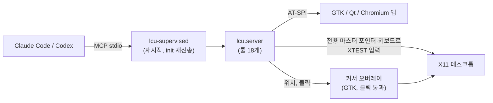

# linux-computer-use

[](https://github.com/flyingsquirrel0419/linux-computer-use/actions/workflows/ci.yml) [](https://github.com/flyingsquirrel0419/linux-computer-use/releases/latest) [](LICENSE) [](#요구-사항) [](https://github.com/flyingsquirrel0419/linux-computer-use/releases)

[English](README.md) | **한국어** | [日本語](README.ja.md) | [简体中文](README.zh-CN.md) | [Español](README.es.md)

리눅스용 computer use입니다. Claude Code와 Codex가 **X11 데스크톱**을 보고 조작하게 해주는 MCP 서버이자 스킬로, 스크린샷·마우스·키보드·접근성 트리를 다룹니다. 에이전트는 **자기 전용 가상 포인터와 키보드**를 쓰기 때문에, 작업하는 동안에도 내 마우스와 포커스는 그대로입니다.


*에이전트가 MCP 툴로 세 앱을 오가며 하나의 작업을 끝냅니다. 터미널에서 파일 관리자를 열고, 폴더를 만들고, gedit에서 `README.md`를 편집·저장한 뒤 git으로 커밋합니다. 일회용 X 디스플레이에서* `scripts/record_demo.sh`*로 녹화했습니다.*

```bash
git clone https://github.com/flyingsquirrel0419/linux-computer-use ~/Documents/linux-computer-use
~/Documents/linux-computer-use/install.sh      # Claude Code와 Codex에 서버와 스킬 등록
claude mcp list                                 # → linux-cu: … run lcu-supervised - ✔ Connected
```

- **추가 프로그램 불필요.** xdotool이나 scrot 없이 순수 Python으로 XTEST, X Input 2, AT-SPI를 씁니다.
- **전용 포인터.** 에이전트마다 두 번째 X 마스터 포인터·키보드가 생깁니다. 내 커서는 움직이지 않고, 포커스된 창도 바뀌지 않습니다.
- **네이티브 위젯.** `ui_tree`가 버튼과 입력 칸을 좌표와 함께 보여주고, `click_element`·`set_text`로 바로 조작합니다.
- **유니코드 입력.** 한글, CJK, 이모지가 입력됩니다. ibus 한글 입력기가 켜져 있어도 됩니다.
- **Codex 스타일 커서.** 클릭이 통과하는 오버레이가 Codex computer use와 같은 모양과 움직임으로 에이전트 포인터를 그립니다.
- **죽어도 복구.** 감시 프로세스가 서버를 다시 띄우고 MCP 세션을 복구하므로, 세션 도중 도구가 사라지지 않습니다.

## 목차

- [동작 원리](#동작-원리)
- [요구 사항](#요구-사항)
- [빠른 시작](#빠른-시작)
- [툴](#툴)
- [가상 포인터](#가상-포인터)
- [에이전트 커서](#에이전트-커서)
- [자동 재시작](#자동-재시작)
- [스킬과 플러그인](#스킬과-플러그인)
- [설정](#설정)
- [수동 등록](#수동-등록)
- [문제 해결](#문제-해결)
- [제거](#제거)
- [안전](#안전)
- [개발](#개발)
- [출처](#출처)
- [라이선스](#라이선스)

## 동작 원리



에이전트가 주고받는 모든 좌표는 에이전트가 받은 스크린샷의 픽셀 좌표입니다(기본적으로 긴 변 1280px). 실제 픽셀로는 서버가 변환하므로 모델이 직접 환산할 일이 없습니다.

## 요구 사항

| | |
|---|---|
| OS / 세션 | **X11** 세션의 리눅스(테스트 환경: Ubuntu 24.04, Cinnamon). Wayland는 지원하지 않습니다. |
| Python | PyGObject와 AT-SPI가 있는 시스템 `python3` 3.10 이상: `python3-gi gir1.2-atspi-2.0 at-spi2-core`(보통 기본 설치됨) |
| 도구 | [`uv`](https://docs.astral.sh/uv/), `xinput`(가상 포인터용. 없으면 에이전트가 내 마우스를 같이 씀) |
| 에이전트 | [Claude Code](https://claude.com/claude-code)와 Codex CLI 중 하나 이상. `install.sh`가 설치된 쪽을 설정합니다 |

## 빠른 시작

1. **설치**(여러 번 실행해도 안전합니다. `git pull` 뒤에 다시 실행하면 됩니다):

   ```bash
   git clone https://github.com/flyingsquirrel0419/linux-computer-use ~/Documents/linux-computer-use
   ~/Documents/linux-computer-use/install.sh
   ```

   이 스크립트가 하는 일:
   - 시스템 PyGObject를 쓰는 venv를 만듭니다.
   - `linux-cu` MCP 서버를 `lcu-supervised`를 거쳐 Claude Code(사용자 범위)와 Codex(`~/.codex/config.toml`, 백업은 `config.toml.bak-lcu`)에 등록합니다.
   - 스킬을 `~/.claude/skills`와 `~/.codex/skills`에 심링크합니다.

2. **확인**:

   ```bash
   claude mcp list | grep linux-cu     # ✔ Connected
   codex mcp list | grep linux-cu      # enabled
   ```

3. **사용.** Claude Code나 Codex 세션을 **새로** 엽니다(이미 실행 중인 세션은 새 서버를 불러오지 않습니다). 그리고 화면 작업을 요청합니다. 예: *"gedit 열어서 한국어로 짧은 메모 써줘."* 에이전트가 스크린샷을 찍고, 위젯을 찾아 클릭·입력한 뒤 결과를 확인합니다.

## 툴

| 분류 | 툴 |
|---|---|
| 보기 | `screenshot`(영역 확대 가능), `screen_info`, `cursor_position`, `active_window` |
| 마우스 | `click`(더블/트리플, 수정키), `mouse_move`, `drag`, `mouse_down`, `mouse_up`, `scroll` |
| 키보드 | `type_text`(모든 유니코드), `key`(`ctrl+shift+t`, `alt+F4`, `Return`…), `hold_key` |
| 접근성 | `list_windows`, `ui_tree`, `click_element`, `set_text` |
| 기타 | `wait`(기다린 뒤 스크린샷 반환) |

- 동작 툴에 `screenshot_after: true`를 주면 결과 화면을 같은 호출에서 받습니다.
- `type_text`와 `key`는 `expect_window`(대상 창 제목이나 WM 클래스의 일부)를 받습니다. 키를 받을 창이 맞지 않으면 아무것도 보내지 않습니다.
- `ui_tree`는 `[9] push button "저장" @(756,21)` 같은 줄을 돌려줍니다. id는 다음 `ui_tree` 호출 전까지 유효합니다.

## 가상 포인터

Codex computer use처럼 에이전트는 자기 입력 장치로 작업합니다. 첫 동작 때 서버가 `lcu-<pid>`라는 X Input 2 마스터 포인터·키보드 쌍을 만들고, 모든 XTEST 입력을 그쪽으로 보냅니다.

- 내 마우스는 움직이지 않고 키보드 포커스도 바뀌지 않으니 계속 작업할 수 있습니다.
- 에이전트 클릭은 창을 앞으로 올리거나 활성화하지 않습니다. **에이전트 키 입력은 에이전트 포인터 아래 창으로 갑니다.** 그래서 `click_element`와 `set_text`는 먼저 포인터를 해당 요소 위로 옮깁니다.
- 에이전트마다 포인터가 따로 생깁니다. Claude Code와 Codex를 함께 쓰면 커서가 두 개 보입니다. 서버가 끝나면 포인터를 지우고, 비정상 종료로 남은 포인터는 다음 실행 때 정리합니다.
- 이 모드가 켜져 있으면 `screen_info`가 `"virtual_pointer": true`를 보고합니다.

**한계:** 에이전트는 화면에 보이는 것만 조작할 수 있습니다. 가려진 창 위치를 클릭하면 위에 있는 창이 클릭됩니다.

## 에이전트 커서

클릭이 통과하는 GTK 오버레이가 에이전트 포인터를 그립니다.

- **모양:** Codex `AgentCursor` 윤곽, 14px. 클릭 지점은 화살표 끝이 아니라 **중앙**입니다. 반투명 그라데이션 채움, 1.55px 테두리, 은은한 글로우가 있습니다.
- **이동:** 후보 20개 중 고른 3차 곡선을 스프링(감쇠 0.9)으로 따라갑니다. 196px 이상 움직이면 진행 방향으로 늘어나고(×1.38 / ×0.82) 최대 76°까지 기울어집니다.
- **클릭:** 250ms 동안 눌림 펄스(크기 −10%)가 나옵니다.
- **대기:** 에이전트가 대기(생각) 중일 때 살짝 흔들립니다.
- **색:** Codex처럼 배경화면에서 가져옵니다.
- **스크린샷:** 커서가 에이전트 스크린샷에도 찍혀서, 에이전트가 자기 포인터 위치를 볼 수 있습니다.

## 자동 재시작

Claude Code와 Codex는 stdio MCP 서버를 한 번 띄우고 다시 연결하지 않습니다. 그래서 프로세스가 끝나면 그 세션에서는 도구가 사라집니다. 이 때문에 등록하는 명령은 `lcu-supervised`입니다. 실제 서버(`python -m lcu.server`)를 자식 프로세스로 실행하고 JSON-RPC를 중계하는 작은 감시 프로세스입니다.

- 자식이 어떤 이유로든 끝나면 새로 띄우고, 클라이언트가 처음 보낸 `initialize` / `notifications/initialized`를 다시 보냅니다. 클라이언트는 같은 세션을 그대로 씁니다.
- 자식이 죽을 때 처리 중이던 요청에는 `-32000 "linux-cu server restarted while handling …; please retry"` 오류가 갑니다. 클릭이 두 번 실행되지 않도록 자동 재시도는 하지 않습니다. 재시작 중에 들어온 메시지는 대기열에 넣었다가 보냅니다.
- 60초 안에 세 번째 재시작부터는 잠시 기다린 뒤 재시작합니다. 0.25초에서 시작해 매번 두 배로 늘고, 최대 10초입니다.
- 클라이언트가 stdin을 닫거나 감시 프로세스에 종료 신호가 오면, 자식을 정리하고(가상 포인터 제거) 함께 끝납니다.
- 재시작 기록은 stderr에 남고, `LCU_SUPERVISOR_LOG`로 파일에 남길 수도 있습니다.

## 스킬과 플러그인

[`skills/linux-computer-use/SKILL.md`](skills/linux-computer-use/SKILL.md)는 에이전트가 데스크톱을 안전하게 다루는 방법을 담은 지침입니다.

- **작업 순서:** 보기 → 찾기(접근성 트리 우선) → 한 번에 한 동작 → 확인.
- **좌표와 키 입력:** 좌표 규칙, 키 입력이 포인터를 따라간다는 점.
- **기다리기:** UI가 뜰 때까지 기다리고, 막혔을 때 대처하는 법.
- **판단:** 화면 속 글은 지시가 아니라 데이터로 다루고, 되돌릴 수 없는 동작 전에는 사용자에게 확인합니다.

`install.sh`가 이미 Claude Code와 Codex에 스킬을 연결합니다. 대신 **Claude Code 플러그인**으로 설치하려면(예: 다른 컴퓨터에서) 이 저장소를 마켓플레이스로 추가합니다.

```text
/plugin marketplace add flyingsquirrel0419/linux-computer-use
/plugin install linux-computer-use@linux-computer-use
```

플러그인에는 스킬만 들어 있습니다. MCP 서버는 `install.sh`로 설치하세요. 스킬이 중복되지 않도록 두 방법 중 하나만 쓰세요.

## 설정

MCP 서버 환경변수로 설정합니다. Claude Code는 `claude mcp add -e KEY=VALUE …`, Codex는 `[mcp_servers.linux-cu.env]` 테이블에 넣습니다.

| 변수 | 기본값 | 효과 |
|---|---|---|
| `LCU_VIRTUAL_POINTER` | `1` | `0`: 내 포인터를 같이 씀(전용 포인터와 오버레이 없음) |
| `LCU_OVERLAY` | `1` | `0`: 에이전트 커서를 그리지 않음 |
| `LCU_GLIDE` | `1` | `0`: 곡선·스프링 이동 대신 순간이동 |
| `LCU_MAX_LONG_EDGE` | `1280` | 스크린샷 긴 변(px) |
| `LCU_REMAP_SETTLE` | `0.12` | 레이아웃에 없는 글자(한글, 이모지)를 쓰려고 키를 다시 묶은 뒤 기다리는 시간(초). 그런 글자의 첫 글자가 빠지거나 틀리면 늘리세요 |
| `LCU_IME_BYPASS` | `1` | `0`: 입력 중 ibus를 일반 엔진으로 바꾸지 않음 |
| `LCU_PLAIN_ENGINE` | `xkb:us::eng` | 입력 중 쓸 ibus 엔진 |
| `LCU_CURSOR_COLOR` | 배경화면 | 고정 커서 색 `#rrggbb` |
| `LCU_CURSOR_SCALE` | `1.0` | 커서 배율(1.0 = 14px) |
| `LCU_CURSOR_LABEL` | 없음 | 커서 옆 이름표. `auto`면 클라이언트 이름(Claude/Codex) |
| `LCU_CURSOR_ICON` | Codex 글리프 | 직접 만든 PNG/SVG 아이콘 |
| `LCU_CURSOR_HOTSPOT` | `0,0` | 그 아이콘 안의 클릭 지점(px) |
| `LCU_CURSOR_SIZE` | `28` | 커스텀 아이콘 높이(px) |
| `LCU_SUPERVISOR_LOG` | stderr | 감시 프로세스 재시작 기록 파일 |

클라이언트가 `DISPLAY`, `XAUTHORITY`, `DBUS_SESSION_BUS_ADDRESS`를 넘기지 않으면 자동으로 감지합니다. 디스플레이는 데스크톱 세션이 쓰는 것을 우선합니다([`src/lcu/env.py`](src/lcu/env.py)).

## 수동 등록

`install.sh`를 쓰지 않으려면 venv를 만들고 서버를 직접 등록합니다.

```bash
cd ~/Documents/linux-computer-use
uv venv --python /usr/bin/python3 --system-site-packages   # 시스템 PyGObject(gi) 사용
uv sync
claude mcp add -s user linux-cu -- uv --directory "$PWD" run lcu-supervised
```

Codex는 `~/.codex/config.toml`에 추가합니다.

```toml
[mcp_servers.linux-cu]
command = "uv"
args = ["--directory", "/home/you/Documents/linux-computer-use", "run", "lcu-supervised"]
startup_timeout_sec = 60
tool_timeout_sec = 120
default_tools_approval_mode = "approve"   # 호출마다 승인 생략. `codex exec`에서는 필수
```

## 문제 해결

<details>
<summary><code>ui_tree</code>가 비었거나 앱이 안 보일 때</summary>

GTK 앱은 대개 바로 보입니다. 안 보이면 툴킷 접근성을 켜고 앱을 다시 실행하세요.

```bash
gsettings set org.gnome.desktop.interface toolkit-accessibility true
```

Chrome, Chromium, Electron 앱(VS Code, Slack 등)은 `--force-renderer-accessibility`가 필요합니다. 없으면 스크린샷과 좌표로 조작합니다.
</details>

<details>
<summary><code>virtual_pointer</code>가 <code>false</code>일 때</summary>

`screen_info`의 `error` 항목을 보세요. 흔한 원인은 `xinput` 미설치(`sudo apt install xinput`)나 `LCU_VIRTUAL_POINTER=0` 설정입니다. 이 모드에서는 에이전트가 내 실제 마우스를 움직입니다.
</details>

<details>
<summary>한글 등 비ASCII 글자가 빠지거나 틀리게 입력될 때</summary>

- **키보드 레이아웃에 없는 글자**는 빈 keycode에 잠깐 묶어서 입력합니다. 키맵 변경을 늦게 반영하는 앱이라면 `LCU_REMAP_SETTLE`을 늘리세요(예: `0.25`).
- **ibus 한글 모드:** 입력하는 동안 ibus를 `LCU_PLAIN_ENGINE`으로 바꿨다가 되돌립니다. 그 뒤 ibus-hangul은 `initial-input-mode`(보통 영문)로 다시 시작합니다.
</details>

<details>
<summary>세션에서 도구가 사라졌을 때</summary>

등록된 명령이 `lcu`가 아니라 `lcu-supervised`인지 확인하세요(`claude mcp get linux-cu`). `install.sh`를 다시 실행하면 예전 등록이 바뀝니다. 변경 전에 시작한 세션은 새 세션을 열 때까지 예전 서버를 씁니다.
</details>

<details>
<summary>Wayland에서 아무것도 안 될 때</summary>

Wayland는 다른 클라이언트의 XTEST 입력과 화면 캡처를 막습니다. X11 세션으로 로그인하세요.
</details>

## 제거

```bash
claude mcp remove -s user linux-cu
rm ~/.claude/skills/linux-computer-use ~/.codex/skills/linux-computer-use   # 심링크만 삭제
```

`~/.codex/config.toml`에서 `[mcp_servers.linux-cu]` 테이블을 지우거나 `~/.codex/config.toml.bak-lcu`로 되돌리세요. 비정상 종료로 에이전트 포인터가 남았다면 지웁니다.

```bash
xinput list --short | grep lcu-
xinput remove-master "lcu-<pid> pointer"
```

## 안전

- 에이전트는 **실제 데스크톱**을 조작합니다. 스킬의 지침 말고는 별도 안전장치가 없고, `default_tools_approval_mode = "approve"`면 Codex는 묻지 않고 도구를 호출합니다.
- 에이전트를 격리하려면 서버 환경에 `DISPLAY=:99`를 넣어 별도 디스플레이(예: 창 관리자를 띄운 `Xvfb :99`)에서 실행하세요.
- 내 화면의 스크린샷은 에이전트가 쓰는 모델 제공자에게 전송됩니다.
- 취약점은 비공개로 신고해 주세요. [SECURITY.md](SECURITY.md)를 참고하세요.

## 개발

```bash
uv run python scripts/smoke_mcp.py            # 읽기 전용: 툴 목록, 화면 정보, 창 목록, 스크린샷 저장
DISPLAY=:99 uv run python scripts/smoke_mcp.py
uv run python scripts/smoke_mcp.py --direct   # 감시 프로세스 없이 직접 연결
scripts/record_demo.sh                       # 일회용 디스플레이에서 docs/demo.gif 다시 녹화
```

소스 구성: [`server.py`](src/lcu/server.py)(MCP 툴), [`supervisor.py`](src/lcu/supervisor.py), [`vpointer.py`](src/lcu/vpointer.py)(MPX 포인터), [`input.py`](src/lcu/input.py)(XTEST, 키맵), [`capture.py`](src/lcu/capture.py), [`a11y.py`](src/lcu/a11y.py)(AT-SPI), [`overlay.py`](src/lcu/overlay.py) / [`motion.py`](src/lcu/motion.py)(커서), [`ime.py`](src/lcu/ime.py), [`env.py`](src/lcu/env.py).

릴리스 기록: [CHANGELOG.md](CHANGELOG.md). 기여 방법: [CONTRIBUTING.md](CONTRIBUTING.md).

## 출처

[`src/lcu/motion.py`](src/lcu/motion.py)의 커서 글리프와 모션 모델은 [maka-agent](https://github.com/maka-agent/maka-agent)(Apache-2.0)에서 옮겨왔습니다. 그 프로젝트가 Codex 데스크톱 앱에서 복원한 값입니다. [NOTICE](NOTICE)를 참고하세요. 이 프로젝트는 OpenAI나 Anthropic과 관계가 없으며 승인받지 않았습니다.

## 라이선스

[Apache License 2.0](LICENSE). 출처 고지는 [NOTICE](NOTICE)를 참고하세요.
