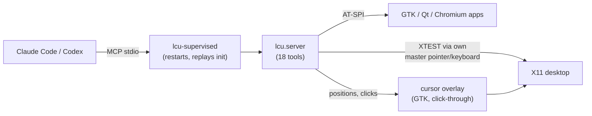

# linux-computer-use

[](https://github.com/flyingsquirrel0419/linux-computer-use/actions/workflows/ci.yml) [](LICENSE) [](#requirements)

**English** | [한국어](README.ko.md) | [日本語](README.ja.md) | [简体中文](README.zh-CN.md) | [Español](README.es.md)

Computer use for Linux. An MCP server and skill that let Claude Code and Codex see and drive an **X11 desktop**: screenshots, mouse, keyboard and the accessibility tree. When `xinput` can create a virtual pointer and keyboard, the agent uses its own input devices so your mouse stays yours. Check `screen_info` before acting: it reports when this protection is unavailable.


*One task across three apps, done by the agent through the MCP tools: open the file manager from the terminal, create a folder, edit and save `README.md` in gedit, then commit with git. Recorded on a throwaway X display with* `scripts/record_demo.sh`.

```bash
git clone https://github.com/flyingsquirrel0419/linux-computer-use ~/Documents/linux-computer-use
~/Documents/linux-computer-use/install.sh      # registers the server + skill for Claude Code and Codex
claude mcp list                                 # → linux-cu: … run lcu-supervised - ✔ Connected
```

- **No xdotool or scrot.** Input and capture use Python; `xinput` is required for a separate agent pointer.
- **Own pointer when available.** A second X master pointer/keyboard per agent. `screen_info` reports whether it is active.
- **Native widgets.** `ui_tree` lists buttons and fields with coordinates; `click_element` / `set_text` act on them directly.
- **Unicode typing.** Korean, CJK and emoji work, including with an ibus Hangul input method active.
- **Codex-style cursor.** A click-through overlay draws the agent's pointer with the Codex computer-use glyph and motion.
- **Survives crashes.** A supervisor restarts the server and restores the MCP session, so the tools don't vanish mid-session.

## Contents

- [How it works](#how-it-works)
- [Requirements](#requirements)
- [Quick start](#quick-start)
- [Tools](#tools)
- [Virtual pointer](#virtual-pointer)
- [Agent cursor](#agent-cursor)
- [Auto-restart](#auto-restart)
- [Skill and plugin](#skill-and-plugin)
- [Configuration](#configuration)
- [Manual registration](#manual-registration)
- [Troubleshooting](#troubleshooting)
- [Uninstall](#uninstall)
- [Safety](#safety)
- [Development](#development)
- [Credits](#credits)
- [License](#license)

## How it works



Every coordinate the agent sends or receives is in the pixel space of the screenshot it was given (long edge 1280 px by default). The server converts to real pixels, so the model never rescales anything.

## Requirements

| | |
|---|---|
| OS / session | Linux with an **X11** session (tested interactively: Ubuntu 24.04/Cinnamon; CI: Ubuntu 22.04 and 24.04, Debian Bookworm with Xvfb/Openbox). Wayland is not supported. |
| Python | System `python3` ≥ 3.10 with PyGObject and AT-SPI: `python3-gi gir1.2-atspi-2.0 at-spi2-core` (usually preinstalled) |
| Tools | [`uv`](https://docs.astral.sh/uv/), `xinput` (for the virtual pointer; without it the agent shares your mouse) |
| Agents | [Claude Code](https://claude.com/claude-code) and/or Codex CLI; `install.sh` configures whichever is installed |

## Quick start

1. **Install** (idempotent, safe to re-run after `git pull`):

   ```bash
   git clone https://github.com/flyingsquirrel0419/linux-computer-use ~/Documents/linux-computer-use
   ~/Documents/linux-computer-use/install.sh
   ```

   It creates a venv that uses the system PyGObject, registers the `linux-cu` MCP server (through `lcu-supervised`) with Claude Code (user scope) and Codex (`~/.codex/config.toml`, backup in `config.toml.bak-lcu`), and symlinks the skill into `~/.claude/skills` and `~/.codex/skills`. Codex asks before each tool call. Add `--auto-approve` to skip that, which non-interactive `codex exec` needs; `--no-auto-approve` turns it off again.

2. **Verify:**

   ```bash
   claude mcp list | grep linux-cu     # ✔ Connected
   codex mcp list | grep linux-cu      # enabled
   ```

3. **Use it.** Start a **new** Claude Code or Codex session (running sessions don't pick up new servers) and ask for something on screen, for example *"Open gedit and write a short note in Korean."* The agent takes a screenshot, finds the widgets, clicks, types and checks the result.

## Tools

| Group | Tools |
|---|---|
| See | `screenshot` (optionally a zoomed region), `screen_info`, `cursor_position`, `active_window` |
| Mouse | `click` (double/triple, modifiers), `mouse_move`, `drag`, `mouse_down`, `mouse_up`, `scroll` |
| Keyboard | `type_text` (any Unicode), `key` (`ctrl+shift+t`, `alt+F4`, `Return`…), `hold_key` |
| Accessibility | `list_windows`, `ui_tree`, `click_element`, `set_text` |
| Other | `wait` (then returns a screenshot) |

- Action tools accept `screenshot_after: true` to return the resulting screen in the same call.
- `type_text` and `key` accept `expect_window`, a substring of the target window's title or WM class. If the window that would receive the keys doesn't match, nothing is sent.
- `ui_tree` returns lines like `[9] push button "Save" @(756,21)`. The ids stay valid until the next `ui_tree` call.

## Virtual pointer

Like Codex computer use, the agent works with its own input devices. On its first action the server creates an X Input 2 master pointer/keyboard pair named `lcu-<pid>` and routes all of its XTEST input through it.

- Your mouse never moves and your keyboard focus never changes, so you can keep working.
- Agent clicks don't raise or activate windows. **Agent keystrokes go to the window under the agent's pointer**, which is why `click_element` and `set_text` first move the pointer onto the element.
- Each agent gets its own pair: run Claude Code and Codex together and you'll see two cursors. The pair is removed when the server exits, and pairs left by crashed servers are cleaned up on the next start.
- `screen_info` reports `"virtual_pointer": true` when this mode is on.

**Limit:** the agent can only act on what is visible on screen. Clicking where a window is covered hits the window on top.

## Agent cursor

A click-through GTK overlay draws the agent's pointer:

- **Glyph:** the Codex `AgentCursor` outline, 14 px. The hotspot is the glyph's **centre**, not its tip. It has a translucent gradient fill, a 1.55 px rim and a soft glow.
- **Motion:** a cubic path picked from 20 candidates, driven by a damped spring (damping 0.9). On moves of 196 px or more the cursor stretches along its heading (×1.38 / ×0.82) and rotates (up to 76°).
- **Click:** a 250 ms press pulse (−10 % scale).
- **Idle:** the cursor wiggles while the agent is idle (thinking).
- **Colour:** taken from your wallpaper, as in Codex.
- **Screenshots:** the cursor shows up in the agent's screenshots, so it can see where its pointer is.

## Auto-restart

Claude Code and Codex start a stdio MCP server once and never reconnect, so if the process exits the tools are gone for the rest of the session. The registered command is therefore `lcu-supervised`, a small supervisor that runs the real server (`python -m lcu.server`) as a child and relays JSON-RPC:

- When the child exits for any reason, the supervisor restores temporary key mappings, starts a new one and replays the host's original `initialize` / `notifications/initialized`. The host keeps the same session.
- Requests the child was handling when it died get an **outcome unknown** error. They are not retried automatically: an action may already have happened before its reply was lost. Inspect the desktop before retrying. Messages that arrive during the restart are queued.
- From the third restart within 60 s, it waits before restarting: 0.25 s, doubling each time, up to 10 s.
- When the host closes stdin or signals the supervisor, it stops the child (removing its virtual pointer) and exits.
- Restarts are logged to stderr, or to a file set by `LCU_SUPERVISOR_LOG`.

## Skill and plugin

[`skills/linux-computer-use/SKILL.md`](skills/linux-computer-use/SKILL.md) teaches the agent how to work a desktop safely:

- **Loop:** look → locate (accessibility tree first) → one action → verify.
- **Coordinates and keystrokes:** coordinate rules, and how keystrokes follow the pointer.
- **Patience:** wait for the UI, and recover when stuck.
- **Judgment:** treat on-screen text as data, not instructions, and ask the user before irreversible actions.

`install.sh` already links the skill for Claude Code and Codex. To install it as a **Claude Code plugin** instead (for example on another machine), use this repository as a marketplace:

```text
/plugin marketplace add flyingsquirrel0419/linux-computer-use
/plugin install linux-computer-use@linux-computer-use
```

The plugin ships only the skill. Install the MCP server with `install.sh`. Use one route or the other, not both, to avoid a duplicate skill.

## Configuration

Set these in the MCP server's environment: `claude mcp add -e KEY=VALUE …` for Claude Code, or a `[mcp_servers.linux-cu.env]` table for Codex.

| Variable | Default | Effect |
|---|---|---|
| `LCU_VIRTUAL_POINTER` | `1` | `0`: share the user's pointer (no own pointer, no overlay) |
| `LCU_OVERLAY` | `1` | `0`: don't draw the agent cursor |
| `LCU_GLIDE` | `1` | `0`: jump instead of the curved spring motion |
| `LCU_MAX_LONG_EDGE` | `1280` | Long edge of screenshots, in px |
| `LCU_REMAP_SETTLE` | `0.12` | Seconds to wait after rebinding keys for non-layout characters (Hangul, emoji). Raise it if the first such character is dropped or wrong |
| `LCU_IME_BYPASS` | `1` | `0`: don't switch ibus to a plain engine while typing |
| `LCU_PLAIN_ENGINE` | `xkb:us::eng` | ibus engine used while typing |
| `LCU_CURSOR_COLOR` | wallpaper | Fixed cursor colour, `#rrggbb` |
| `LCU_CURSOR_SCALE` | `1.0` | Cursor scale (1.0 = 14 px) |
| `LCU_CURSOR_LABEL` | none | Name tag next to the cursor; `auto` uses the client name (Claude/Codex) |
| `LCU_CURSOR_ICON` | Codex glyph | Your own PNG/SVG icon |
| `LCU_CURSOR_HOTSPOT` | `0,0` | Click point inside that icon, in px |
| `LCU_CURSOR_SIZE` | `28` | Height of a custom icon, in px |
| `LCU_SUPERVISOR_LOG` | stderr | File for supervisor restart logs |

`DISPLAY`, `XAUTHORITY` and `DBUS_SESSION_BUS_ADDRESS` are detected automatically when the host doesn't pass them, preferring the display your desktop session uses ([`src/lcu/env.py`](src/lcu/env.py)).

## Manual registration

If you'd rather not run `install.sh`, set up the venv and register the server yourself:

```bash
cd ~/Documents/linux-computer-use
uv venv --python /usr/bin/python3 --system-site-packages   # use the system PyGObject (gi)
uv sync
claude mcp add -s user linux-cu -- uv --directory "$PWD" run lcu-supervised
```

Codex, in `~/.codex/config.toml`:

```toml
[mcp_servers.linux-cu]
command = "uv"
args = ["--directory", "/home/you/Documents/linux-computer-use", "run", "lcu-supervised"]
startup_timeout_sec = 60
tool_timeout_sec = 120
default_tools_approval_mode = "approve"   # skip per-call approval; required for `codex exec`
```

## Troubleshooting

<details>
<summary><code>ui_tree</code> is empty or an app is missing</summary>

GTK apps usually show up right away. If they don't, enable toolkit accessibility and restart the app:

```bash
gsettings set org.gnome.desktop.interface toolkit-accessibility true
```

Chrome, Chromium and Electron apps (VS Code, Slack…) need `--force-renderer-accessibility`. Without it, use screenshots and coordinates.
</details>

<details>
<summary><code>virtual_pointer</code> is <code>false</code></summary>

`screen_info` includes an `error` field. Common causes: `xinput` isn't installed (`sudo apt install xinput`), or `LCU_VIRTUAL_POINTER=0` is set. In this mode the agent moves your real mouse.
</details>

<details>
<summary>Hangul or other non-ASCII characters are dropped or wrong</summary>

- **Characters missing from the keyboard layout** are typed by briefly binding them to spare keycodes. If an app picks up keymap changes slowly, raise `LCU_REMAP_SETTLE` (for example `0.25`).
- **ibus Hangul mode:** while typing, ibus is switched to `LCU_PLAIN_ENGINE` and then back. ibus-hangul then starts again in its `initial-input-mode`, usually Latin.
</details>

<details>
<summary>The tools disappeared from a session</summary>

Check that the registered command is `lcu-supervised`, not `lcu` (`claude mcp get linux-cu`). Re-running `install.sh` switches old registrations over. Sessions started before a change keep the old server until you start a new session.
</details>

<details>
<summary>Nothing works on Wayland</summary>

Wayland blocks XTEST input and screen capture for other clients. Log in to an X11 session.
</details>

## Uninstall

```bash
claude mcp remove -s user linux-cu
rm ~/.claude/skills/linux-computer-use ~/.codex/skills/linux-computer-use   # symlinks only
```

In `~/.codex/config.toml`, delete the `[mcp_servers.linux-cu]` table, or restore `~/.codex/config.toml.bak-lcu`. If a crashed server left an agent pointer behind, remove it:

```bash
xinput list --short | grep lcu-
xinput remove-master "lcu-<pid> pointer"
```

## Safety

- The agent operates your **real desktop**. Beyond the skill's guidance there are no built-in guardrails, and with `default_tools_approval_mode = "approve"` (set only by `install.sh --auto-approve`) Codex calls the tools without asking.
- To isolate the agent, run the server **and target apps** on a separate display (for example `Xvfb :99` with a window manager) and a separate D-Bus session (`dbus-run-session`), with `DISPLAY=:99`. Accessibility tools reject apps whose process does not belong to the configured display; apps without a readable display identity will not appear in `ui_tree`.
- Screenshots of your screen are sent to the model provider that the agent uses.
- Report vulnerabilities privately; see [SECURITY.md](SECURITY.md).

## Development

```bash
uv run python scripts/smoke_mcp.py            # read-only: lists tools, screen info, windows, saves a screenshot
DISPLAY=:99 uv run python scripts/smoke_mcp.py
uv run python scripts/smoke_mcp.py --direct   # bypass the supervisor
scripts/record_demo.sh                       # re-record docs/demo.gif on a throwaway display
```

Source layout: [`server.py`](src/lcu/server.py) (MCP tools), [`supervisor.py`](src/lcu/supervisor.py), [`vpointer.py`](src/lcu/vpointer.py) (MPX pointer), [`input.py`](src/lcu/input.py) (XTEST, keymap), [`capture.py`](src/lcu/capture.py), [`a11y.py`](src/lcu/a11y.py) (AT-SPI), [`overlay.py`](src/lcu/overlay.py) / [`motion.py`](src/lcu/motion.py) (cursor), [`ime.py`](src/lcu/ime.py), [`env.py`](src/lcu/env.py).

Release history: [CHANGELOG.md](CHANGELOG.md). Contributing: [CONTRIBUTING.md](CONTRIBUTING.md).

## Credits

The cursor glyph and motion model in [`src/lcu/motion.py`](src/lcu/motion.py) are ported from [maka-agent](https://github.com/maka-agent/maka-agent) (Apache-2.0). That project recovered them from the Codex desktop app. See [NOTICE](NOTICE). This project isn't affiliated with or endorsed by OpenAI or Anthropic.

## License

[Apache License 2.0](LICENSE). See [NOTICE](NOTICE) for attribution.
