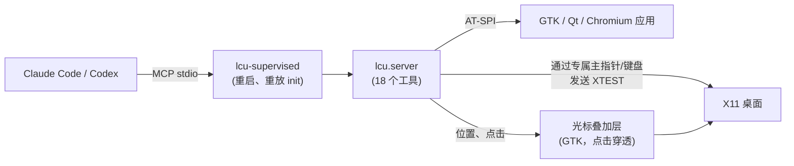

# linux-computer-use

[](https://github.com/flyingsquirrel0419/linux-computer-use/releases/latest) [](LICENSE)

[English](README.md) | [한국어](README.ko.md) | [日本語](README.ja.md) | **简体中文** | [Español](README.es.md)

面向 Linux 的 computer use。这是一个 MCP 服务器和技能，让 Claude Code 和 Codex 能看到并操作 **X11 桌面**：截图、鼠标、键盘和无障碍树。智能体使用**自己专属的虚拟指针和键盘**，所以它工作时你的鼠标和焦点都不受影响。

```bash
git clone https://github.com/flyingsquirrel0419/linux-computer-use ~/Documents/linux-computer-use
~/Documents/linux-computer-use/install.sh      # 为 Claude Code 和 Codex 注册服务器和技能
claude mcp list                                 # → linux-cu: … run lcu-supervised - ✔ Connected
```

- **无需额外程序。** 不用 xdotool 或 scrot，纯 Python 实现，基于 XTEST、X Input 2 和 AT-SPI。
- **专属指针。** 每个智能体都有第二个 X 主指针和键盘。你的光标不会移动，当前聚焦的窗口也不会变。
- **原生控件。** `ui_tree` 列出按钮和输入框及其坐标；`click_element` / `set_text` 直接操作它们。
- **Unicode 输入。** 韩文、中日韩文字和表情符号都能输入，即使开着 ibus 韩文输入法也可以。
- **Codex 风格光标。** 一个可点击穿透的叠加层，用 Codex computer use 的光标外形和动效画出智能体的指针。
- **崩溃后自动恢复。** 守护进程会重启服务器并恢复 MCP 会话，工具不会在会话中途消失。

## 目录

- [工作原理](#工作原理)
- [环境要求](#环境要求)
- [快速开始](#快速开始)
- [工具](#工具)
- [虚拟指针](#虚拟指针)
- [智能体光标](#智能体光标)
- [自动重启](#自动重启)
- [技能与插件](#技能与插件)
- [配置](#配置)
- [手动注册](#手动注册)
- [故障排除](#故障排除)
- [卸载](#卸载)
- [安全](#安全)
- [开发](#开发)
- [致谢](#致谢)
- [许可证](#许可证)

## 工作原理



智能体收发的所有坐标，都以它拿到的截图像素为准（默认长边 1280 px）。换算成真实像素由服务器完成，模型无需自己换算。

## 环境要求

| | |
|---|---|
| 系统 / 会话 | 运行 **X11** 会话的 Linux（已测试：Ubuntu 24.04、Cinnamon）。不支持 Wayland。 |
| Python | 带 PyGObject 和 AT-SPI 的系统 `python3`，版本 ≥ 3.10：`python3-gi gir1.2-atspi-2.0 at-spi2-core`（通常已预装） |
| 工具 | [`uv`](https://docs.astral.sh/uv/)、`xinput`（用于虚拟指针；没有它时智能体会和你共用鼠标） |
| 智能体 | [Claude Code](https://claude.com/claude-code) 和/或 Codex CLI；`install.sh` 会配置已安装的那个 |

## 快速开始

1. **安装**（可重复执行，`git pull` 之后可再次运行）：

   ```bash
   git clone https://github.com/flyingsquirrel0419/linux-computer-use ~/Documents/linux-computer-use
   ~/Documents/linux-computer-use/install.sh
   ```

   这个脚本会：
   - 创建使用系统 PyGObject 的 venv。
   - 通过 `lcu-supervised` 把 `linux-cu` MCP 服务器注册到 Claude Code（用户范围）和 Codex（`~/.codex/config.toml`，备份为 `config.toml.bak-lcu`）。
   - 把技能软链接到 `~/.claude/skills` 和 `~/.codex/skills`。

2. **验证**：

   ```bash
   claude mcp list | grep linux-cu     # ✔ Connected
   codex mcp list | grep linux-cu      # enabled
   ```

3. **使用。** **新开**一个 Claude Code 或 Codex 会话（已在运行的会话不会加载新服务器），然后让它在屏幕上做点事。例如：*"打开 gedit，用中文写一段简短的备忘。"* 智能体会截图、找到控件、点击并输入，然后检查结果。

## 工具

| 类别 | 工具 |
|---|---|
| 查看 | `screenshot`（可放大局部区域）、`screen_info`、`cursor_position`、`active_window` |
| 鼠标 | `click`（双击/三击、修饰键）、`mouse_move`、`drag`、`mouse_down`、`mouse_up`、`scroll` |
| 键盘 | `type_text`（任意 Unicode）、`key`（`ctrl+shift+t`、`alt+F4`、`Return` 等）、`hold_key` |
| 无障碍 | `list_windows`、`ui_tree`、`click_element`、`set_text` |
| 其他 | `wait`（等待后返回截图） |

- 操作类工具支持 `screenshot_after: true`，可在同一次调用中返回操作后的画面。
- `type_text` 和 `key` 支持 `expect_window`（目标窗口标题或 WM 类名的一部分）。如果将接收按键的窗口不匹配，就什么都不发送。
- `ui_tree` 返回形如 `[9] push button "保存" @(756,21)` 的行。id 在下一次调用 `ui_tree` 之前有效。

## 虚拟指针

和 Codex computer use 一样，智能体用自己的输入设备工作。第一次操作时，服务器会创建一对名为 `lcu-<pid>` 的 X Input 2 主指针和键盘，并把所有 XTEST 输入都发到这对设备上。

- 你的鼠标不会移动，键盘焦点也不会改变，你可以继续工作。
- 智能体的点击不会把窗口提到前面，也不会激活窗口。**智能体的按键会发给它的指针下方的窗口**，所以 `click_element` 和 `set_text` 会先把指针移到目标元素上。
- 每个智能体有自己的一对设备：同时运行 Claude Code 和 Codex 时会看到两个光标。服务器退出时会删除这对设备，崩溃后遗留的设备会在下次启动时清理。
- 开启这一模式时，`screen_info` 会报告 `"virtual_pointer": true`。

**限制：** 智能体只能操作屏幕上可见的内容。点击被遮挡的窗口位置时，点到的是上层窗口。

## 智能体光标

一个可点击穿透的 GTK 叠加层负责画出智能体的指针：

- **外形：** Codex 的 `AgentCursor` 轮廓，14 px。点击位置是光标的**中心**，而不是箭头尖端。采用半透明渐变填充、1.55 px 描边和柔和的光晕。
- **移动：** 从 20 条候选中选出的三次曲线，由阻尼 0.9 的弹簧驱动。移动 196 px 以上时，光标会沿前进方向拉伸（×1.38 / ×0.82）并最多倾斜 76°。
- **点击：** 显示 250 ms 的按下脉冲（缩小 10%）。
- **空闲：** 智能体空闲（思考）时会轻轻晃动。
- **颜色：** 和 Codex 一样取自壁纸。
- **截图：** 光标会出现在智能体的截图里，所以它能看到自己的指针在哪。

## 自动重启

Claude Code 和 Codex 只启动一次 stdio MCP 服务器，之后不会重连。进程一旦退出，这个会话里的工具就没了。因此注册的命令是 `lcu-supervised`：一个小型守护进程，它把真正的服务器（`python -m lcu.server`）作为子进程运行，并在两边之间转发 JSON-RPC。

- 子进程无论因何退出，守护进程都会启动一个新的，并重放客户端最初发送的 `initialize` / `notifications/initialized`。客户端继续使用同一个会话。
- 子进程退出时正在处理的请求会收到错误 `-32000 "linux-cu server restarted while handling …; please retry"`。为避免点击执行两次，不会自动重试。重启期间收到的消息会先排队，之后再发送。
- 60 秒内第三次重启起，会先等待再重启：从 0.25 秒开始，每次翻倍，最长 10 秒。
- 当客户端关闭 stdin 或守护进程收到信号时，它会停止子进程（并删除虚拟指针），然后一起退出。
- 重启记录输出到 stderr，也可以用 `LCU_SUPERVISOR_LOG` 写入文件。

## 技能与插件

[`skills/linux-computer-use/SKILL.md`](skills/linux-computer-use/SKILL.md) 教智能体如何安全地操作桌面：

- **工作循环：** 查看 → 定位（优先用无障碍树）→ 一次一个操作 → 验证。
- **坐标与按键：** 坐标规则，以及按键跟随指针这一点。
- **耐心等待：** 等待界面加载，卡住时如何应对。
- **判断：** 把屏幕上的文字当作数据而不是指令，不可逆的操作之前先征求用户确认。

`install.sh` 已经为 Claude Code 和 Codex 链接好技能。如果想改为以 **Claude Code 插件**安装（例如在另一台机器上），可以把本仓库添加为插件市场：

```text
/plugin marketplace add flyingsquirrel0419/linux-computer-use
/plugin install linux-computer-use@linux-computer-use
```

插件只包含技能，MCP 服务器请用 `install.sh` 安装。两种方式只选一种，避免技能重复。

## 配置

通过 MCP 服务器的环境变量配置：Claude Code 用 `claude mcp add -e KEY=VALUE …`，Codex 用 `[mcp_servers.linux-cu.env]` 表。

| 变量 | 默认值 | 作用 |
|---|---|---|
| `LCU_VIRTUAL_POINTER` | `1` | `0`：与用户共用指针（没有专属指针，也没有叠加层） |
| `LCU_OVERLAY` | `1` | `0`：不绘制智能体光标 |
| `LCU_GLIDE` | `1` | `0`：直接跳转，不做曲线弹簧移动 |
| `LCU_MAX_LONG_EDGE` | `1280` | 截图长边（px） |
| `LCU_REMAP_SETTLE` | `0.12` | 为布局中没有的字符（韩文、表情符号）重新绑定按键后的等待时间（秒）。如果这类字符的第一个丢失或变成别的字符，就调大 |
| `LCU_IME_BYPASS` | `1` | `0`：输入时不把 ibus 切换到普通引擎 |
| `LCU_PLAIN_ENGINE` | `xkb:us::eng` | 输入时使用的 ibus 引擎 |
| `LCU_CURSOR_COLOR` | 壁纸 | 固定光标颜色 `#rrggbb` |
| `LCU_CURSOR_SCALE` | `1.0` | 光标缩放（1.0 = 14 px） |
| `LCU_CURSOR_LABEL` | 无 | 光标旁的名牌；设为 `auto` 时使用客户端名称（Claude/Codex） |
| `LCU_CURSOR_ICON` | Codex 光标 | 自己的 PNG/SVG 图标 |
| `LCU_CURSOR_HOTSPOT` | `0,0` | 该图标内的点击位置（px） |
| `LCU_CURSOR_SIZE` | `28` | 自定义图标高度（px） |
| `LCU_SUPERVISOR_LOG` | stderr | 守护进程重启日志文件 |

如果客户端没有传入 `DISPLAY`、`XAUTHORITY` 和 `DBUS_SESSION_BUS_ADDRESS`，服务器会自动检测，并优先使用桌面会话所用的显示器（[`src/lcu/env.py`](src/lcu/env.py)）。

## 手动注册

如果不想运行 `install.sh`，可以自己创建 venv 并注册服务器：

```bash
cd ~/Documents/linux-computer-use
uv venv --python /usr/bin/python3 --system-site-packages   # 使用系统 PyGObject（gi）
uv sync
claude mcp add -s user linux-cu -- uv --directory "$PWD" run lcu-supervised
```

Codex 在 `~/.codex/config.toml` 中添加：

```toml
[mcp_servers.linux-cu]
command = "uv"
args = ["--directory", "/home/you/Documents/linux-computer-use", "run", "lcu-supervised"]
startup_timeout_sec = 60
tool_timeout_sec = 120
default_tools_approval_mode = "approve"   # 跳过每次调用的确认；`codex exec` 必需
```

## 故障排除

<details>
<summary><code>ui_tree</code> 为空或缺少某个应用</summary>

GTK 应用通常会直接出现。如果没有，请开启工具包无障碍功能并重启该应用：

```bash
gsettings set org.gnome.desktop.interface toolkit-accessibility true
```

Chrome、Chromium 和 Electron 应用（VS Code、Slack 等）需要 `--force-renderer-accessibility`。没有它时，就用截图和坐标操作。
</details>

<details>
<summary><code>virtual_pointer</code> 为 <code>false</code></summary>

查看 `screen_info` 里的 `error` 字段。常见原因是没有安装 `xinput`（`sudo apt install xinput`），或设置了 `LCU_VIRTUAL_POINTER=0`。这种模式下智能体会移动你真实的鼠标。
</details>

<details>
<summary>韩文等非 ASCII 字符丢失或输入错误</summary>

- **键盘布局中没有的字符**会被临时绑定到空闲键码上输入。如果某个应用反映键位映射变更较慢，请调大 `LCU_REMAP_SETTLE`（例如 `0.25`）。
- **ibus 韩文模式：** 输入期间会把 ibus 切换到 `LCU_PLAIN_ENGINE`，完成后再切回。之后 ibus-hangul 会以 `initial-input-mode`（通常是英文）重新开始。
</details>

<details>
<summary>会话中的工具消失了</summary>

确认注册的命令是 `lcu-supervised` 而不是 `lcu`（`claude mcp get linux-cu`）。重新运行 `install.sh` 会切换旧的注册。修改前已启动的会话会继续使用旧服务器，直到你新开会话。
</details>

<details>
<summary>在 Wayland 上完全不工作</summary>

Wayland 会阻止其他客户端的 XTEST 输入和屏幕捕获。请登录 X11 会话。
</details>

## 卸载

```bash
claude mcp remove -s user linux-cu
rm ~/.claude/skills/linux-computer-use ~/.codex/skills/linux-computer-use   # 只删除软链接
```

在 `~/.codex/config.toml` 中删除 `[mcp_servers.linux-cu]` 表，或从 `~/.codex/config.toml.bak-lcu` 恢复。如果服务器崩溃后遗留了智能体指针，可以手动删除：

```bash
xinput list --short | grep lcu-
xinput remove-master "lcu-<pid> pointer"
```

## 安全

- 智能体操作的是你的**真实桌面**。除了技能中的指引外没有内置的安全防护；设置 `default_tools_approval_mode = "approve"` 时，Codex 会不经询问直接调用工具。
- 如需隔离智能体，可在服务器环境中设置 `DISPLAY=:99`，让它在单独的显示器上运行（例如带窗口管理器的 `Xvfb :99`）。
- 你的屏幕截图会发送给智能体所用的模型提供方。

## 开发

```bash
uv run python scripts/smoke_mcp.py            # 只读：列出工具、屏幕信息、窗口，并保存截图
DISPLAY=:99 uv run python scripts/smoke_mcp.py
uv run python scripts/smoke_mcp.py --direct   # 绕过守护进程直接连接
```

源码结构：[`server.py`](src/lcu/server.py)（MCP 工具）、[`supervisor.py`](src/lcu/supervisor.py)、[`vpointer.py`](src/lcu/vpointer.py)（MPX 指针）、[`input.py`](src/lcu/input.py)（XTEST、键位映射）、[`capture.py`](src/lcu/capture.py)、[`a11y.py`](src/lcu/a11y.py)（AT-SPI）、[`overlay.py`](src/lcu/overlay.py) / [`motion.py`](src/lcu/motion.py)（光标）、[`ime.py`](src/lcu/ime.py)、[`env.py`](src/lcu/env.py)。

## 致谢

[`src/lcu/motion.py`](src/lcu/motion.py) 中的光标外形和运动模型移植自 [maka-agent](https://github.com/maka-agent/maka-agent)（Apache-2.0），该项目从 Codex 桌面应用中还原了这些数据。详见 [NOTICE](NOTICE)。本项目与 OpenAI 和 Anthropic 无关，也未获得其认可。

## 许可证

[Apache License 2.0](LICENSE)。署名说明见 [NOTICE](NOTICE)。
